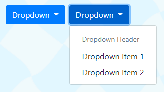
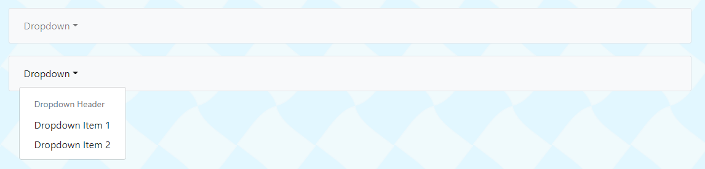

# simple-ng-bootstrap-dropdown

A small simple Angular+bootstrap dropdown control with few/no dependencies.

Sometimes you need a simple dropdown menu, and you don't want to add another component library.

## Prerequisites

1. You're using Angular.
2. You're using Bootstrap.

## How To Use It

1. Add the `drop-down.directive.ts` file to your project.
2. Add the `DropDownDirective` to your angular module where you plan to use the directive.
3. Add the `appDropDown` directive selector to your dropdown controls in your templates as per the examples below.

## Examples

### As a Button



```html
<div class="btn-group" role="group" appDropDown>
    <button type="button" class="btn btn-primary dropdown-toggle">Dropdown</button>
    <div class="dropdown-menu">
        <div class="dropdown-header">Dropdown Header</div>
        <a class="dropdown-item">Dropdown Item 1</a>
        <a class="dropdown-item">Dropdown Item 2</a>
    </div>
</div>
```

### In a Nav



```html
<nav class="navbar navbar-expand-sm navbar-toggleable-sm navbar-light bg-light border rounded-sm">
    <div class="navbar-collapse collapse d-sm-inline-flex flex-sm-row">
        <ul class="navbar-nav flex-grow">
            <li class="nav-item dropdown" appDropDown>
                <a class="nav-link dropdown-toggle clickable">Dropdown</a>
                <div class="dropdown-menu">
                    <div class="dropdown-header">Dropdown Header</div>
                    <a class="dropdown-item">Dropdown Item 1</a>
                    <a class="dropdown-item">Dropdown Item 2</a>
                </div>
            </li>
        </ul>
    </div>
</nav>
```

You can add this `clickable` style to add the pointer cursor when hovering:
```css
.clickable {
    cursor: pointer;
}
```

## Support

[](https://ko-fi.com/N4N0AP4NH)
